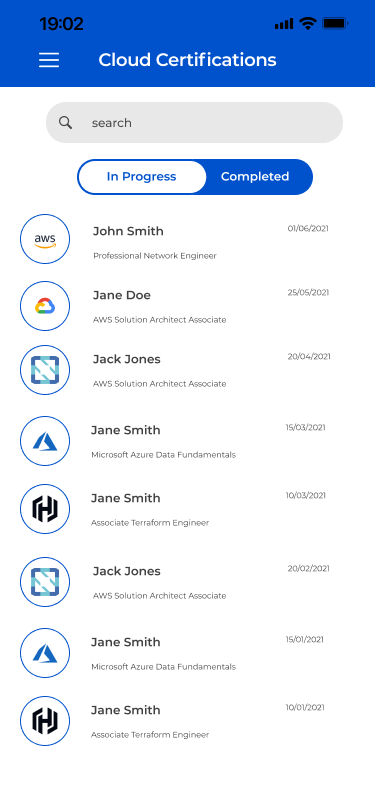

[![Contributors][contributors-shield]][contributors-url]
[![Forks][forks-shield]][forks-url]
[![Stargazers][stars-shield]][stars-url]
[![Issues][issues-shield]][issues-url]
[![MIT License][license-shield]][license-url]

<!-- PROJECT LOGO -->
<br />
<p align="center">
  <a href="https://github.com/capcodigital/flutter-confluence">
    
  </a>

  <h3 align="center">Flutter Confluence</h3>

  <p align="center">
  An application built in Flutter that showcases confluence pages
    <br />
    <a href="https://github.com/capcodigital/flutter-confluence"><strong>Explore the docs »</strong></a>
    <br />
    <br />
    <a href="https://github.com/capcodigital/flutter-confluence">View Demo</a>
    ·
    <a href="https://github.com/capcodigital/flutter-confluence/issues">Report Bug</a>
    ·
    <a href="https://github.com/capcodigital/flutter-confluence/issues">Request Feature</a>
  </p>
</p>

<!-- TABLE OF CONTENTS -->
<details open="open">
  <summary><h2 style="display: inline-block">Table of Contents</h2></summary>
  <ol>
    <li>
      <a href="#about-the-project">About The Project</a>
      <ul>
        <li><a href="#built-with">Built With</a></li>
      </ul>
    </li>
    <li>
      <a href="#getting-started">Getting Started</a>
      <ul>
        <li><a href="#prerequisites">Prerequisites</a></li>
        <li><a href="#installation">Installation</a></li>
      </ul>
    </li>
    <li><a href="#usage">Usage</a></li>
    <li><a href="#roadmap">Roadmap</a></li>
    <li><a href="#contributing">Contributing</a></li>
    <li><a href="#license">License</a></li>
    <li><a href="#contact">Contact</a></li>
    <li><a href="#acknowledgements">Acknowledgements</a></li>
  </ol>
</details>

<!-- ABOUT THE PROJECT -->
## About The Project
[Flutter Demo]()
[![Product Name Screen Shot][product-screenshot]](https://example.com)


### Built With

* [Flutter](https://flutter.dev/)
* [Firebase](https://https://firebase.google.com/)
* [CircleCI](https://circleci.com/)

<!-- GETTING STARTED -->
## Getting Started

To get a local copy up and running follow these simple steps.

### Prerequisites

* Flutter
* Firebase CLI

#### Flutter Installation

In order to run the application locally, you must have the Flutter SDK installed.  Follow the steps within the [Flutter Documentation](https://flutter.dev/docs/get-started/install) to install the Flutter SDK on your local machine.

#### Firebase CLI Installation

In order to acess Firebase CLI, you must install it locally. Follow this [steps](https://firebase.google.com/docs/cli) 

### Installation

```shell
# clone the repo
git clone https://github.com/capcodigital/flutter-confluence.git

# configures the local env
source .env
```

<!-- USAGE EXAMPLES -->
## Usage

### Designs



For details related to the user flow and usage, please visit the [confluence page](https://ilabs-capco.atlassian.net/wiki/spaces/BPG/pages/2610627123/Flutter+Confluence) for this project.

<!-- Test Suite-->
### Test Suite
 Tests help ensure that your app performs correctly before you publish it, while retaining your feature and bug fix velocity. We have used following types of test in the project.. 
 
 * Unit Test: tests a single function, method, or class.
 * Widget Test: tests a single widget
 * Integration Test: tests a complete app or a large part of an app.

 more about testing in flutter can be found [here](https://docs.flutter.dev/testing).

 Use following command
 ```shell
# to run test in terminal
flutter test   
```

<!-- ROADMAP -->
## Roadmap

See the [open issues](https://github.com/capcodigital/flutter-confluence/issues) for a list of proposed features (and known issues).

<!-- CONTRIBUTING -->
## Contributing

Contributions are what make the open source community such an amazing place to be learn, inspire, and create. Any contributions you make are **greatly appreciated**.

1. Fork the Project
2. Create your Feature Branch (`git checkout -b feature/AmazingFeature`)
3. Commit your Changes (`git commit -m 'Add some AmazingFeature'`)
4. Push to the Branch (`git push origin feature/AmazingFeature`)
5. Open a Pull Request

If you would like to contribute to any Capco Digital OSS projects please read:

* [Code of Conduct](https://github.com/capcodigital/.github/blob/master/CODE_OF_CONDUCT.md)
* [Contributing Guidelines](https://github.com/capcodigital/.github/blob/master/CONTRIBUTING.md)

<!-- LICENSE -->
## License

Distributed under the MIT License. See `LICENSE` for more information.

<!-- ACKNOWLEDGEMENTS -->
## Acknowledgements

* [Best README Template](https://github.com/othneildrew/Best-README-Template/blob/master/README.md)

<!-- MARKDOWN LINKS & IMAGES -->
<!-- https://www.markdownguide.org/basic-syntax/#reference-style-links -->
[contributors-shield]: https://img.shields.io/github/contributors/capcodigital/flutter-confluence.svg?style=for-the-badge
[contributors-url]: https://github.com/capcodigital/flutter-confluence/graphs/contributors
[forks-shield]: https://img.shields.io/github/forks/capcodigital/flutter-confluence.svg?style=for-the-badge
[forks-url]: https://github.com/capcodigital/flutter-confluence/network/members
[stars-shield]: https://img.shields.io/github/stars/capcodigital/flutter-confluence.svg?style=for-the-badge
[stars-url]: https://github.com/capcodigital/flutter-confluence/stargazers
[issues-shield]: https://img.shields.io/github/issues/capcodigital/flutter-confluence.svg?style=for-the-badge
[issues-url]: https://github.com/capcodigital/flutter-confluence/issues
[license-shield]: https://img.shields.io/github/license/capcodigital/flutter-confluence.svg?style=for-the-badge
[license-url]: https://github.com/capcodigital/flutter-confluence/blob/master/LICENSE
