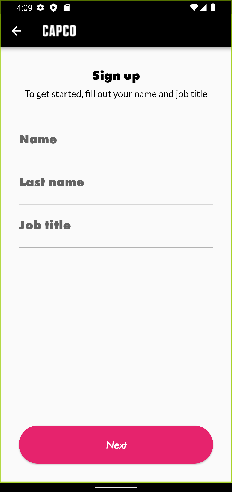
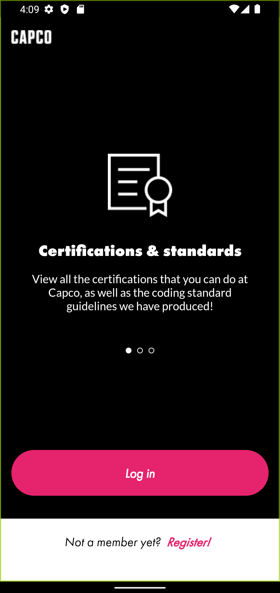
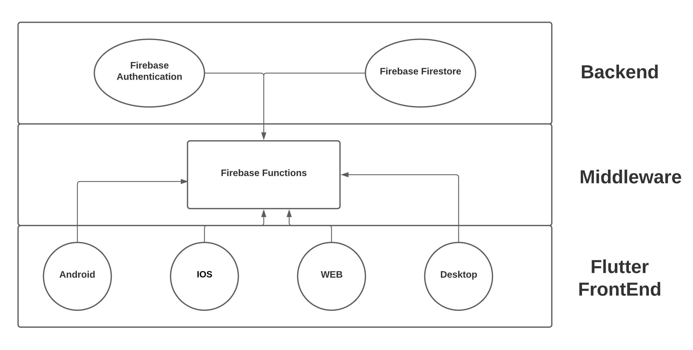
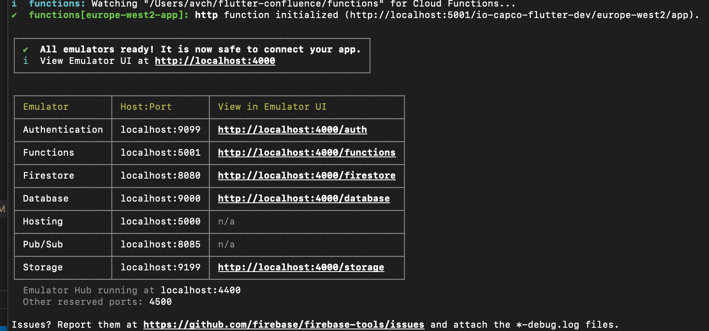

[![Contributors][contributors-shield]][contributors-url]
[![Forks][forks-shield]][forks-url]
[![Stargazers][stars-shield]][stars-url]
[![Issues][issues-shield]][issues-url]
[![MIT License][license-shield]][license-url]

<!-- PROJECT LOGO -->
<br />
<p align="center">
  <a href="https://github.com/capcodigital/flutter-confluence">
    
  </a>

  <h3 align="center">Flutter Confluence</h3>

  <p align="center">
  An application built in Flutter that showcases confluence pages
    <br />
    <a href="https://github.com/capcodigital/flutter-confluence"><strong>Explore the docs »</strong></a>
    <br />
    <br />
    <a href="https://github.com/capcodigital/flutter-confluence">View Demo</a>
    ·
    <a href="https://github.com/capcodigital/flutter-confluence/issues">Report Bug</a>
    ·
    <a href="https://github.com/capcodigital/flutter-confluence/issues">Request Feature</a>
  </p>
</p>

<!-- TABLE OF CONTENTS -->
<details open="open">
  <summary><h2 style="display: inline-block">Table of Contents</h2></summary>
  <ol>
    <li>
      <a href="#about-the-project">About The Project</a>
      <ul>
        <li><a href="#built-with">Built With</a></li>
        <li><a href="#designs">Designs</a></li>
        <li><a href="#architecture">Architecture</a></li>
      </ul>
    </li>
    <li>
      <a href="#getting-started">Getting Started</a>
      <ul>
        <li><a href="#prerequisites">Prerequisites</a></li>
        <li><a href="#installation">Installation</a></li>
        <li><a href="#running-the-app-locally">Running app locally</a></li>
        <li><a href="#major-libraries-used">Major libraries Used</a></li>
      </ul>
    </li>
    <li><a href="#usage">Usage</a></li>
    <li><a href="#roadmap">Roadmap</a></li>
    <li><a href="#contributing">Contributing</a></li>
    <li><a href="#license">License</a></li>
    <li><a href="#contact">Contact</a></li>
    <li><a href="#acknowledgements">Acknowledgements</a></li>
  </ol>
</details>

<!-- ABOUT THE PROJECT -->
## About The Project
[Flutter Demo]()
* This application was initially developed by using data from the Cloud Certifications pages of Confluence that could be retrieved using FastAPI via the Confluence API. This data was then displayed in a Flutter UI. 

* The application now uses firebase functions to fetch data from firestore database.

* The application now has expanded with more features being integrated such as Authentication, profile, Todo





### Built With

* [Flutter](https://flutter.dev/)
* [Firebase](https://https://firebase.google.com/)
* [CircleCI](https://circleci.com/)

### Designs


For details related to the user flow and usage, please visit the [confluence page](https://ilabs-capco.atlassian.net/wiki/spaces/BPG/pages/2610627123/Flutter+Confluence) for this project.


### Architecture
 We pass data through `cloud functions`  which is a serverless framework provided by Google Firebase. High level overview of the architecture can be seen below. For details about this please visit the [confluence page](https://ilabs-capco.atlassian.net/wiki/spaces/BPG/pages/2610627123/Flutter+Demonstrator) for this project.



<!-- GETTING STARTED -->
## Getting Started

To get a local copy up and running follow these simple steps.

### Prerequisites

* Flutter
* Firebase CLI

#### Flutter Installation

In order to run the application locally, you must have the Flutter SDK installed.  Follow the steps within the [Flutter Documentation](https://flutter.dev/docs/get-started/install) to install the Flutter SDK on your local machine.

#### Firebase CLI Installation

In order to acess Firebase CLI, you must install it locally. Follow this [steps](https://firebase.google.com/docs/cli) 


### Installation

```shell
# clone the repo
git clone https://github.com/capcodigital/flutter-confluence.git

# configures the local env
source .env
```

### Running the app locally.
  To run the app locally you need flutter sdk and firebase cli installed as details provided in <a href="#prerequisites">prerequisites</a> section.

 #### Steps to run firebase emulators.
  1. Open terminal app and go to functions folder inside your project folder.
  2. Run `npm run serve`.(if you don't have npm installed, follow [this](https://docs.npmjs.com/downloading-and-installing-node-js-and-npm)).
  
  
 #### Steps to run flutter app locally.
  1. Open flutter app located in `front-end/flutter_confluence` of your project folder in Android Studio, Intellij or Visual Studio Code.
  2. Go to  file named `constants.dart` and replace the `static const BASE_API_URL = 'https://europe-west2-io-capco-flutter-dev.cloudfunctions.net/app';` with `static const BASE_API_URL = 'http://localhost:5001/io-capco-flutter-dev/europe-west2/app';`.
  3. Go to file named `main.dart` and add `  await FirebaseAuth.instance.useAuthEmulator('localhost', 9099);` before `runApp()`.
  4. Go to terminal and Run `Flutter pub get`.(This will load all dependencies).
  5. Once dependencies are loaded. Run `Flutter run`. and The app will be launched in default device.

### Major libraries Used.
* <b>Flutter bloc:</b> Bloc design pattern helps to separate presentation from business logic. Following the BLoC pattern facilitates testability and reusability. [More info](https://pub.dev/packages/bloc)
* <b>Firebase Auth:</b> Firebase Authentication provides backend services, easy-to-use SDKs, and ready-made UI libraries to authenticate users to your app.[More info](https://firebase.google.com/docs/auth)
* <b>Firebase Functions:</b>Cloud Functions for Firebase is a serverless framework that lets you automatically run backend code in response to events triggered by Firebase features and HTTPS requests. [More info](https://firebase.google.com/docs/functions).
* <b>Firebase Firestore:</b>Cloud Firestore is a flexible, scalable database for mobile, web, and server development from Firebase and Google Cloud. [More info](https://firebase.google.com/docs/firestore).
* <b>Lottie:</b> Lottie is a mobile library for Android and iOS that parses Adobe After Effects animations exported as json with Bodymovin and renders them natively on mobile


<!-- USAGE EXAMPLES -->
## Usage
<!-- Test Suite-->
## Test Suite
 Tests help ensure that your app performs correctly before you publish it, while retaining your feature and bug fix velocity. We have used following types of test in the project.. 
 
 * Unit Test: tests a single function, method, or class.
 * Widget Test: tests a single widget
 * Integration Test: tests a complete app or a large part of an app.

 more about testing in flutter can be found [here](https://docs.flutter.dev/testing).

 Use following command
 ```shell
# to run test in terminal
flutter test   
```

<!-- ROADMAP -->
## Roadmap

See the [open issues](https://github.com/capcodigital/flutter-confluence/issues) for a list of proposed features (and known issues).

<!-- CONTRIBUTING -->
## Contributing

Contributions are what make the open source community such an amazing place to be learn, inspire, and create. Any contributions you make are **greatly appreciated**.

1. Fork the Project
2. Create your Feature Branch (`git checkout -b feature/AmazingFeature`)
3. Commit your Changes (`git commit -m 'Add some AmazingFeature'`)
4. Push to the Branch (`git push origin feature/AmazingFeature`)
5. Open a Pull Request

If you would like to contribute to any Capco Digital OSS projects please read:

* [Code of Conduct](https://github.com/capcodigital/.github/blob/master/CODE_OF_CONDUCT.md)
* [Contributing Guidelines](https://github.com/capcodigital/.github/blob/master/CONTRIBUTING.md)

<!-- LICENSE -->
## License

Distributed under the MIT License. See `LICENSE` for more information.

<!-- ACKNOWLEDGEMENTS -->
## Acknowledgements

* [Best README Template](https://github.com/othneildrew/Best-README-Template/blob/master/README.md)

<!-- MARKDOWN LINKS & IMAGES -->
<!-- https://www.markdownguide.org/basic-syntax/#reference-style-links -->
[contributors-shield]: https://img.shields.io/github/contributors/capcodigital/flutter-confluence.svg?style=for-the-badge
[contributors-url]: https://github.com/capcodigital/flutter-confluence/graphs/contributors
[forks-shield]: https://img.shields.io/github/forks/capcodigital/flutter-confluence.svg?style=for-the-badge
[forks-url]: https://github.com/capcodigital/flutter-confluence/network/members
[stars-shield]: https://img.shields.io/github/stars/capcodigital/flutter-confluence.svg?style=for-the-badge
[stars-url]: https://github.com/capcodigital/flutter-confluence/stargazers
[issues-shield]: https://img.shields.io/github/issues/capcodigital/flutter-confluence.svg?style=for-the-badge
[issues-url]: https://github.com/capcodigital/flutter-confluence/issues
[license-shield]: https://img.shields.io/github/license/capcodigital/flutter-confluence.svg?style=for-the-badge
[license-url]: https://github.com/capcodigital/flutter-confluence/blob/master/LICENSE
