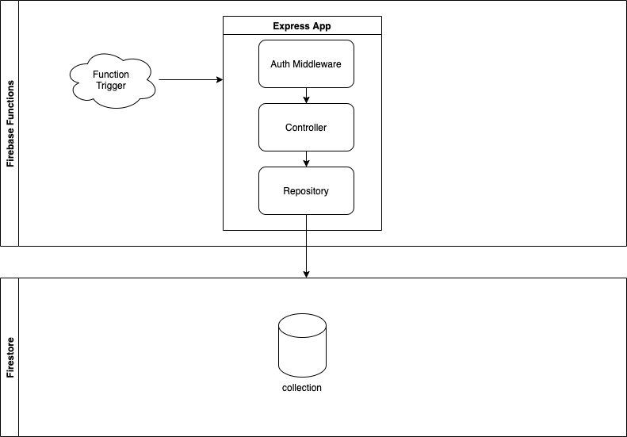
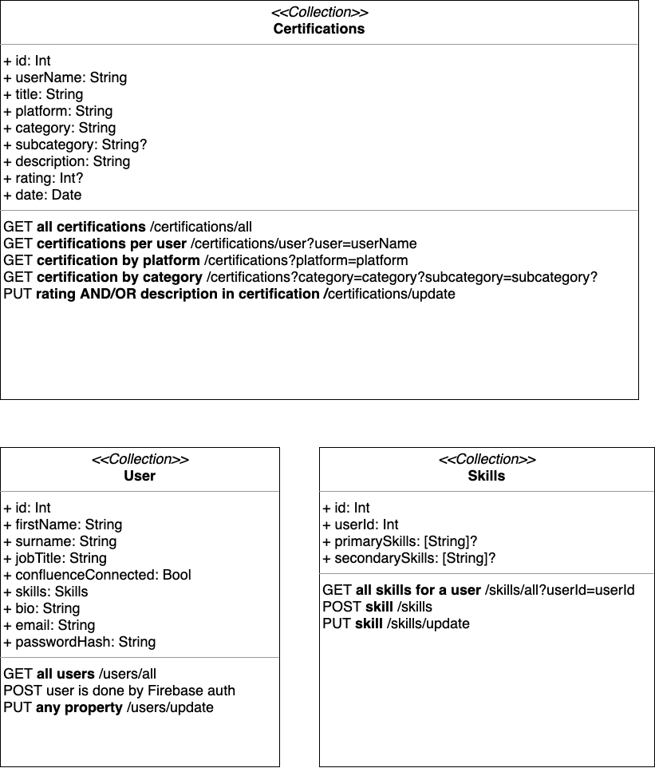
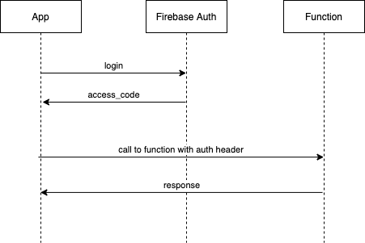
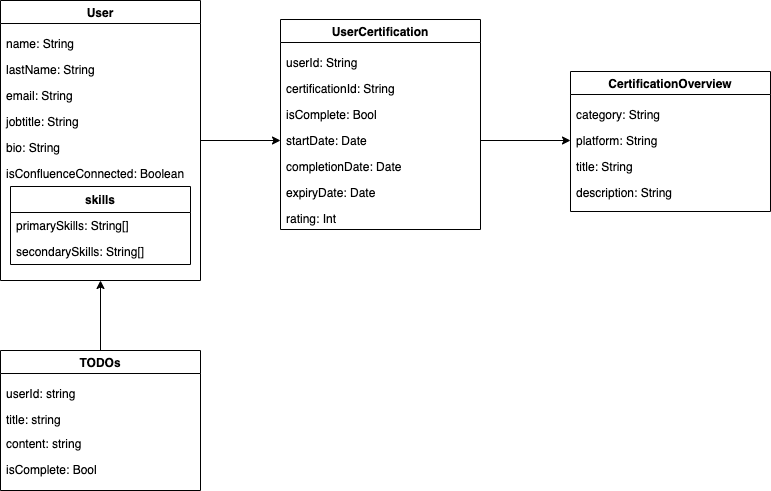

# Firebase Functions

## Overview

Each firebase function has an HTPP trigger at the moment. It uses an Express server to be enhance the capabilties of the standard functions (like allowing us to use middleware).

At the time of writting this document, all the endpoints are secured. The user needs to pass a access token in the authorization header

The auth flow relies in the [Firebase Authentication](https://firebase.google.com/docs/auth), so the token required to send to the funcitons is the one returned by the Firebase auth client.

The function should control only thr HTTP logic (extract parameters and request body, check auth, return HTTP responses).

Then, a "controller" should be called to execute the business logic. If the logic requires to read/write data in the DB, then this would be responsability of a "repository" layer.

At the moment, we use [Firestore](https://firebase.google.com/docs/firestore) as cloud database.



## Transitional Phase

This section illustrates the architecture during the [Transition Phase](https://ilabs-capco.atlassian.net/wiki/spaces/BPG/pages/2610627123/Flutter+Confluence#Transitional). In particular, it highlights how the Firestore database interacts with our front-end as well as with the Confluence API.

## Data Structure

Our data is structured in such as way that we have 3 collections that will sit within our [Firestore](https://firebase.google.com/docs/firestore) database. These are the only collections that our application will be using. In addition to keeping our data in Firestore, we'll also be using [Hive](https://docs.hivedb.dev/) to persist parts of the data for caching.

- Certifications
- Users
- Skills

<p align="center">
    
  </a>

### Certifications

Our Certifications collection is a standardised format that will hold all our data relating to certifications. Some of the data within can't be found on Confluence e.g rating, description but these are properties than can be manually updated via a PUT request. Since we don't have any way of matching a user on Confluence with a user on Firebase via the standard way with a user id, we will use the first name and surname of the user to pair the certificate with the corresponding user.

### Users

Our Users collection is our documents of users who have been authenticated with [Firebase Auth](https://firebase.google.com/docs/auth). They are uploaded onto Firestore by explicitly setting the document name to the user UID that Firebase Auth has given to the user. This can then be retrieved via a GET request with `.doc(user.uid)`. Similar to the Certifications, the properties within the Users collection can be updated with a PUT request.

### Skills

The Skills collection is the collection that relates the primary and secondary skills of the User using a user id. These are the skills that are attached to the user via a POST request during the onboarding flow and again can be updated with a PUT request.

## POST-MVP Phase

This section illustrates the architecture during the [POST-MVP Phase](https://ilabs-capco.atlassian.net/wiki/spaces/BPG/pages/2610627123/Flutter+Confluence#Post-MVP). In this phase, there is no Confluence API and instead the front-end interacts directly with Firestore through Firebase Functions.

# Authorization

Instead of implementing our custom auth mechanism, we delegate this to [Firebase Auth](https://firebase.google.com/docs/auth).

In order to make an aunthenticated call to the function, the client will need to get the token first from the Firebase Auth. Once the client has the `access_token`, then it will need to pass it to the function call

```
Authorization: Bearer <token>
```

If the token is not valid, the function will return an `HTTP 401 - Unauthorized` response



# API documentation

Please find the API documentation using OpenAPI 3.0 [here](documentation/api_schema.yml)
You can open the file using Postman or https://editor.swagger.io/ to explore the API documentation.

# Database documentation

### Diagram


