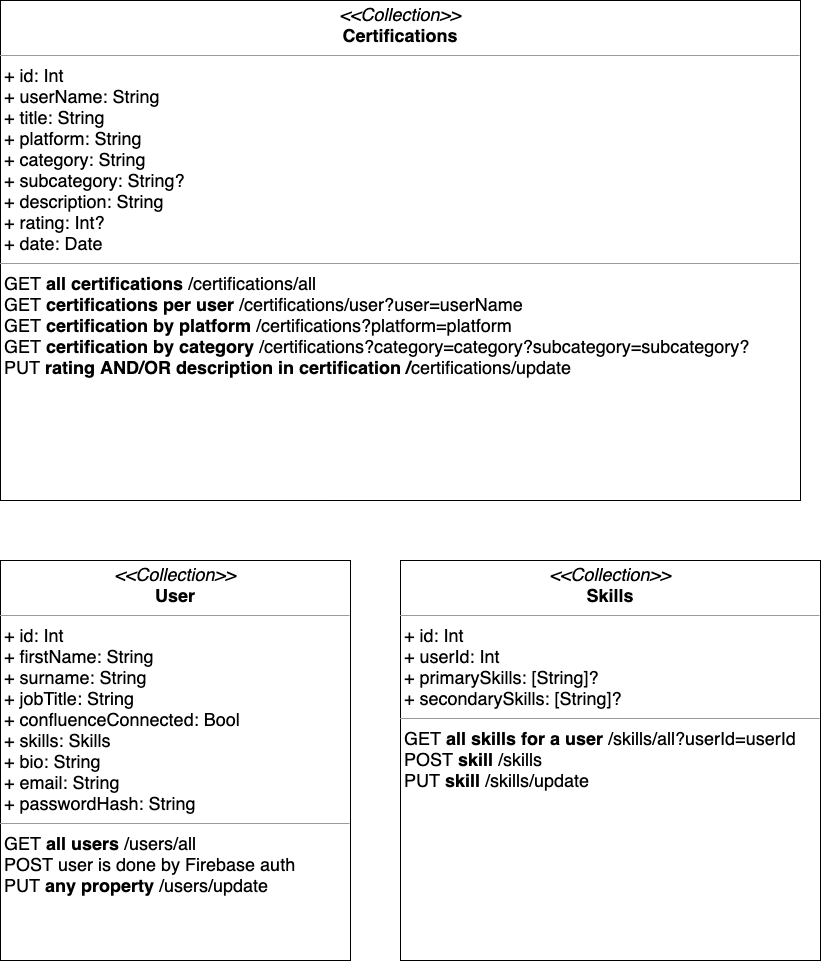

## Data Structure

Our data is structured in such as way that we have 3 collections that will sit within our database.

 * Certifications
 * Users
 * Skills

    
  </a>

### Certifications

Our Certifications collection is a standardised format that will hold all our data relating to certifications. Some of the data within can't be found on Confluence e.g rating, description but these are properties than can be manually updated via a PUT request. Since we don't have any way of matching a user on Confluence with a user via the standard way with a user id, we will use the first name and surname of the user to pair the certificate with the corresponding user.

### Users

Our Users collection is our documents of users who have been authenticated with [Firebase Auth](https://firebase.google.com/docs/auth). They are added onto [Firestore](https://firebase.google.com/docs/firestore) by explicitly setting the document name to the user UID that Firebase Auth has given to the user. This can then be retrieved via a GET request with `.doc(user.uid)`. Similar to the Certifications, the properties within the Users collection can be updated with a PUT request.

### Skills

The Skills collection is the collection that relates the primary and secondary skills of the User using a user id. These are the skills that are attached to the user via a POST request during the onboarding flow and again can be updated with a PUT request.